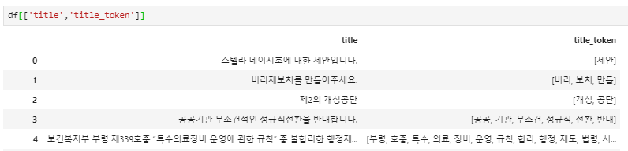
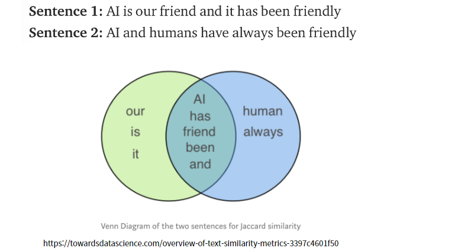
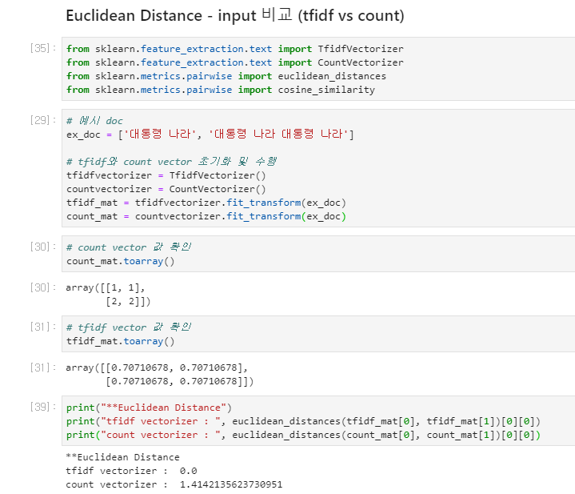

# 문서유사도


## 0. Base

예를 들어 다음과 같이 문서가 있고, 문서를 feature space에 놓는다고 생각해보자

|                      | 강아지 | 귀엽다 | 매우 |
| -------------------- | ------ | ------ | ---- |
| 강아지가 귀엽다      | 1      | 1      | 0    |
| 강아지가 매우 귀엽다 | 1      | 1      | 1    |
| 고양이가 매우 귀엽다 | 0      | 1      | 1    |

각 단어 ‘강아지’, ‘고양이’, ‘매우’를 축으로 하는 특성공간(feature space)에서 다음 문서들을 하나의 좌표로 생각할 수 있음

- ‘강아지가 귀엽다’ --> (1,1,0)
- ‘강아지가 매우 귀엽다’ --> (1,1,1)
- ‘고양이가 매우 귀엽다’ --> (0,1,1)


 
두 단어 혹은 문장이 주어졌을 때, 유사도를 측정하는 방법은 여러가지가 있다

1. cosine similarity
2. jaccard similarity
3. euclidean distance
4. manhattan distance


:mag_right: -

- jaccard 유사도는 중복을 고려하지 X, cosine 유사도는 중복 고려 O


## 1. cosine 유사도

cosine 유사도는 vector로 표현된 두 문장이 이루는 각도의 cosine값이다. 따라서 cosine 유사도를 계산하기 위해서는 <u>**문장을 vector로 변환**</u>하는 작업 필요

### :black_nib: 공식


> **예시 )**
>
> 1. ‘**강아지 귀여워. 강아지 귀여워**’ 와 **강아지 귀여워**’ 
>
>    => similarity : (2,0,2) vector와 (1,0,1) vector 사이의 각도 => cos(0) = 1
>
>    ```python
>    cosine_similarity([[2,0,2]],[[1,0,1]])
>    # 1
>    ```
>
> 2.  ‘**고양이 귀여워’** 와 ‘**강아지 귀여워**’ 
>
>    => similarity : (0,1,1) vector와 (1,0,1) vector 사이의 각도 
>
>    ```python
>    cosine_similarity([[0,1,1]],[[1,0,1]])
>    # 0.5
>    ```
>    


#### 특징 

- 코사인 함수는 -1에서 1사이의 값을 가지지만, feature vector행렬은 음수값이 없으므로 코사인 유사도가 음수가 되지 않음. 따라서 cosine 유사도의 범위는 **0 ~ 1**이 됨


 

#### 문장을 vector로 변환하는 방법

1. TF-IDF를 이용한 bag of words :heavy_check_mark:
2. count vectorizer
3. word2vec

doc을 vector로 변환하게 되면 vector의 길이는 총 문서 내 단어 수가 된다

> **tfidf vs word embedding**
>
> - tf-idf는 한 단어당 한 숫자를 만들어냄 / word embedding은 한 단어당 한 vector를 만들어냄
> - tf-idf는 전체적으로 문서를 분류하는데 잘 작동 / word embedding은 문맥적인 내용을 확인하는데 잘 작동
>


#### 과정

1. 먼저 tf-idf matrix를 생성하여 문서를 벡터화
2. cosine_similarity/linear_kernel 함수를 이용하여 cosine similarity matrix 생성

```python
from sklearn.feature_extraction.text import TfidfVectorizer

tfidf = TfidfVectorizer()
# title에 대해서 tf-idf 수행
tfidf_matrix = tfidf.fit_transform(df['title_token'])
```

> 위 예시에서 사용된 `df[‘title_token’]` 형식
>
> 


3. sklearn에서 제공하는 패키지 중 `linear_kernel`을 사용하여 cosine similarity 계산

```python
from sklearn.metrics.pairwise import cosine_similarity
# scikit-learn cosine similarity API는 희소행렬, 밀집행렬 모두 가능 + 배열, 행렬 모두 가능

from sklearn.metrics.pairwise import linear_kernel
# cosine_similarity보다 빠름

# 앞서 만든 tf-idf matrix로 cosine similarity 계산
cos_sim = linear_kernel(tfidf_matrix,tfidf_matrix)
```

4. 유사도를 이용한 추천 시스템

```python
# 유사도를 이용한 추천
# 보고자하는 index와 가장 유사한 문서 10개의 index 찾기 
# sim score를 내림차순 정렬하여 top10개의 index와 score 반환
def top10(idx, sim_pair) :
    sim_score = list(enumerate(sim_pair[idx]))
    sim_score = sorted(sim_score, key = lambda x:x[1], reverse=True)
    
    # 상위 100개 항목 가져옴
    top10score = sim_score[1:11]
    tag_indices = [i[0] for i in top10score]
    score = [i[1] for i in top10score]
    return tag_indices, score
```


​	

## 2. jaccard 유사도

- 두 문장의 교집합과 합집합의 크기를 통해 구하는 방식 

### :black_nib: 공식


> ##### 예시 )
>
> 다음 두 문장이 주어진다고 가정
>
> 
>
> ※ 위 예시에서는 유사도 계산 전에 lemmatization 과정을 거침 (lemmatization은 단어의 뿌리는 찾는 과정. 예 : had와 has의 뿌리는 *have*)
>
> 다이어그램을 통해 두 문장의 교집합의 단어개수는5개, 합집합은 10개 :arrow_right: jaccard similarity = 0.5
>
> 


#### python code

```python
def get_jaccard_sim(str1, str2): 
    a = set(str1.split()) 
    b = set(str2.split())
    c = a.intersection(b)
    return float(len(c)) / (len(a) + len(b) - len(c))
```

*jaccard 유사도는 set을 사용 :arrow_right: **<u>중복을 고려하지 않음</u>**


## 3. Euclidean 거리

문서를 좌표로 표현하고 두 좌표 사이의 거리를 구하여 유클리드 거리를 계산. 이때, 문서의 좌표는 각 단어의 출현 빈도를 나타내는 __CountVectorizer__ 를 사용하여도 되고, **TfidfVectorizer**를 사용하여도 됨 

단, CountVectorizer를 사용하게 되면, 단어의 출현빈도로 사용하기 때문에 <u>단어의 빈도가 늘어나거나 줄어</u>들면 <u>의미에 차이가 없더라도 거리가 멀어짐</u> 

> **예시 )**
>
> ‘**강아지 귀여워. 강아지 귀여워**’ 와 ‘**고양이 귀여워’** 는 ‘**강아지 귀여워**’ 와 똑같은 거리에 있음
>
> (2,0,2) (0,1,1) (1,0,1)
>
> ‘**강아지 귀여워. 강아지 귀여워**’ 와 **강아지 귀여워**’  ==  ‘**고양이 귀여워’** 와 ‘**강아지 귀여워**’ 
>
> |                              | 강아지 | 고양이 | 귀엽다 |
> | ---------------------------- | ------ | ------ | ------ |
> | 강아지 귀여워. 강아지 귀여워 | 2      | 0      | 2      |
> | 고양이 귀여워                | 0      | 1      | 1      |
> | 강아지 귀여워                | 1      | 0      | 1      |
>
> 1. ‘**강아지 귀여워. 강아지 귀여워**’ 와 **강아지 귀여워**’ 
>
>    => similarity : (2,0,2) vector와 (1,0,1) vector 사이의 거리 => $\sqrt2$
>
>    ```python
>    from sklearn.metrics.pairwise import euclidean_distances
>    euclidean_distances([[2,0,2]],[[1,0,1]])
>    # 1.41421356
>    ```
>
> 2. ‘**고양이 귀여워’** 와 ‘**강아지 귀여워**’ 
>
>    => similarity : (0,1,1) vector와 (1,0,1) vector 사이의 거리 => $\sqrt2$
>
>    ```python
>    from sklearn.metrics.pairwise import euclidean_distances
>    euclidean_distances([[0,1,1]],[[1,0,1]])
>    # 1.41421356
>    ```


 #### tfidf vectorizer vs count vectorizer
 


---

### reference

https://simonezz.tistory.com/45

https://leo-bb.tistory.com/18 

http://doc.mindscale.kr/km/unstructured/04.html  
